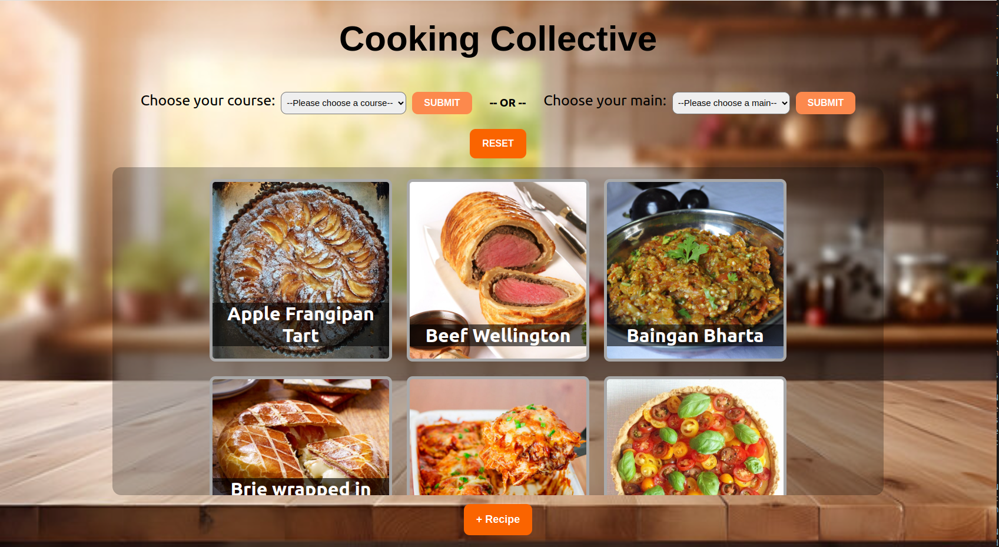
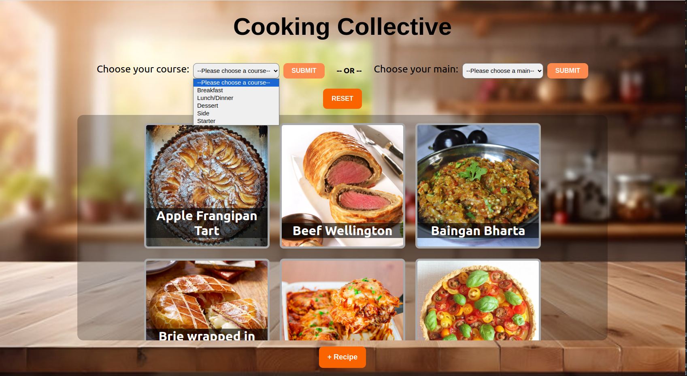
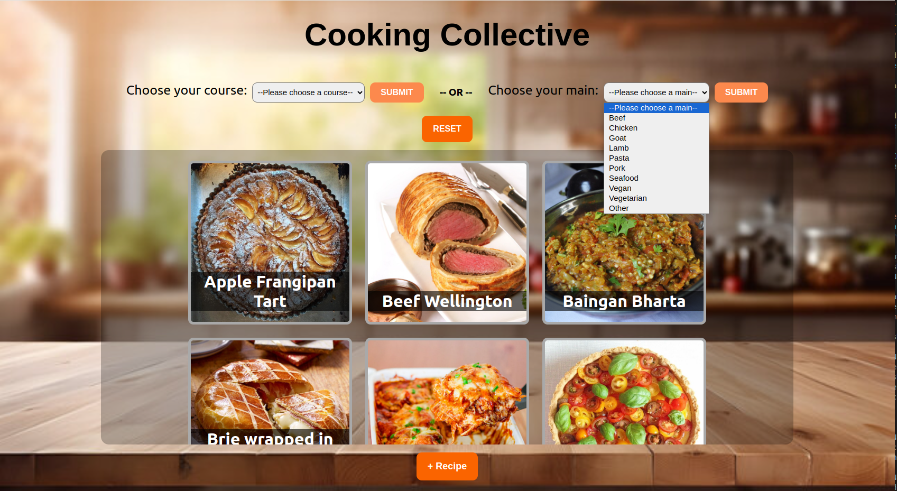
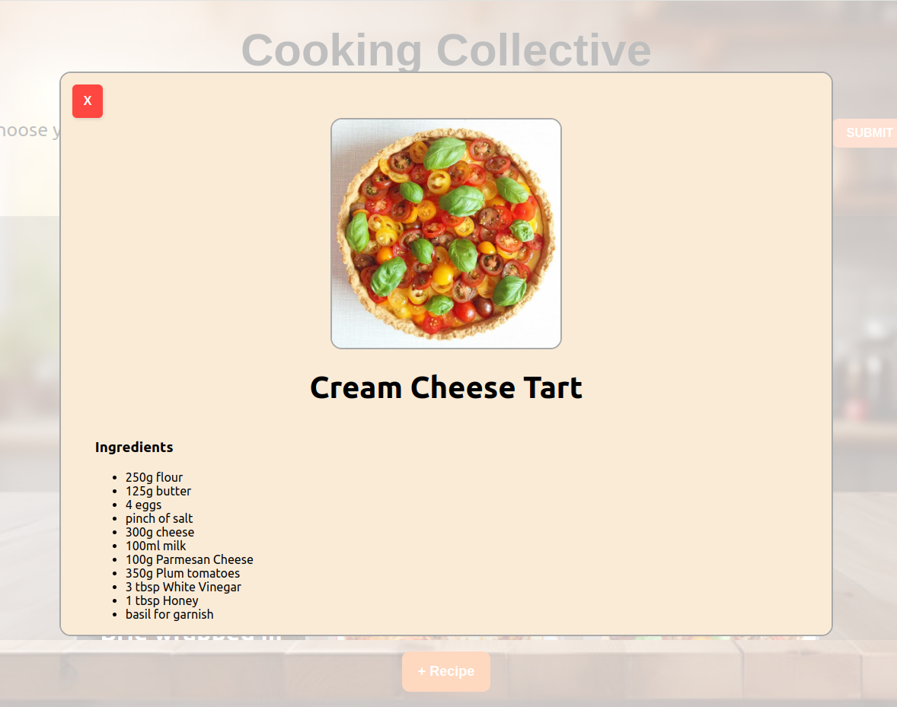
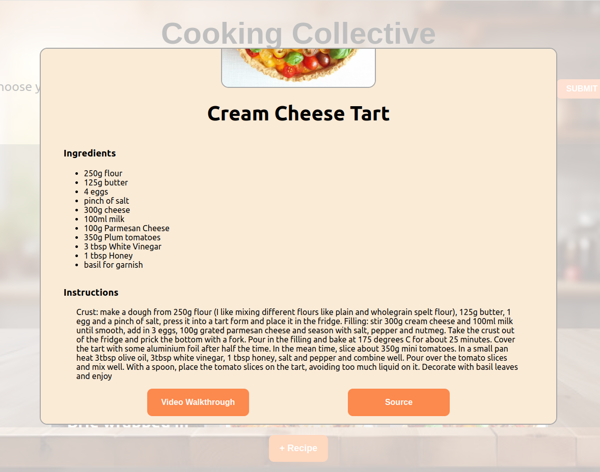
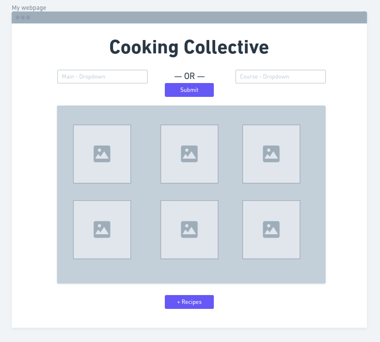
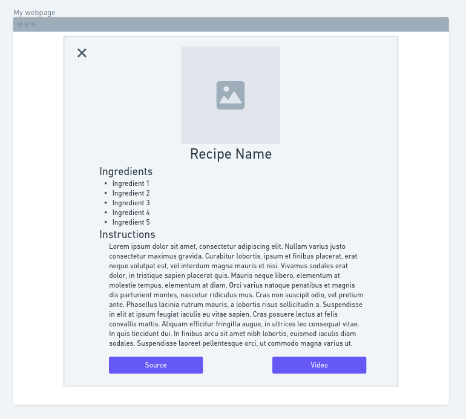
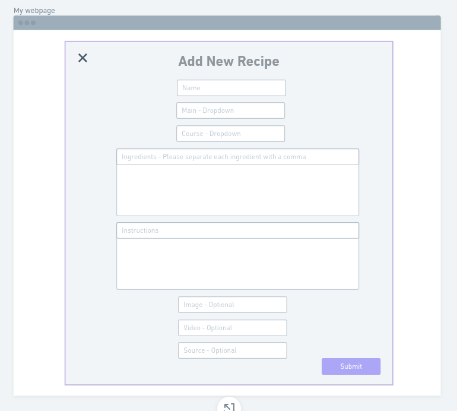

## Cooking Collective

### Overview

Join the Cooking Collective!

Cooking Collective is a site where cooking enthusiests can find new recipes and share their culinary creations.

### Functionality

With the Cooking Collective you can browse through a wide range of recipes spanning different countries with varying main ingredients. Each recipe is fully available and soon you will be able to add your own recipes as well!

See below for how these pages look.

##### Filter Function:

You can filter either by the course you are looking to prepare or by the main ingredient of the dish.

##### Recipe:

The recipe card shows all ingredients with measurements along with detailed instructions. There are also optional links for a video walkthrough or a source. If the recipe doesn't have one or both of these, the buttons will not appear.

### Wireframe

Take a peak below to see where the magic began! You can see where I started and some peeks at what's coming next!

##### Coming Soon!

Soon you will be able to add your own recipes to the collection so anyone can learn to make your favorite recipes!

### Post MVP Goals

<li>User profiles </li>
<li>Add your own recipes</li>
<li>Edit/Delete Recipes you have posted</li>
<li>Follow and chat with other contributors</li>

### Backend

Take a look <a href="https://github.com/geclower/CookingCollective-Backend">HERE</a> for the backend!

In the above linked README, you can find more on my ERD, Routes, and Installation.

### Tech Stack

**Client:** React

**Languages:** JavaScript, HTML, CSS

### Resources

<ul>
    <li><a href="https://whimsical.com/">Whimsical</a></li>
    <li><a href="https://www.npmjs.com/package/react-modal?activeTab=readme">React-Modal</a></li>
    <li><a href="https://www.themealdb.com/api.php">TheMealDB</a></li>
    <li><a href="https://getcssscan.com/css-buttons-examples">Button Inspirations</a></li>

</ul>
